# FreeCodeCamp Responsive Web Design Projects 🖥️📱

Welcome to my collection of Responsive Web Design projects completed as part of the [FreeCodeCamp](https://www.freecodecamp.org/) curriculum. Each project is built with **HTML** and **CSS**, focusing on clean, responsive, and accessible web design.

---

## Projects Overview

| Project Name          | Description                                             | Screenshot / Live Preview                   |
|-----------------------|---------------------------------------------------------|--------------------------------------------|
| Cat Photo App         | Basic HTML practice building a cat image page           | 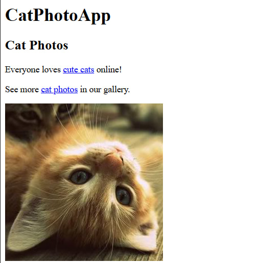 |
| Cafe Menu             | Simple cafe menu with semantic HTML and clean CSS       | 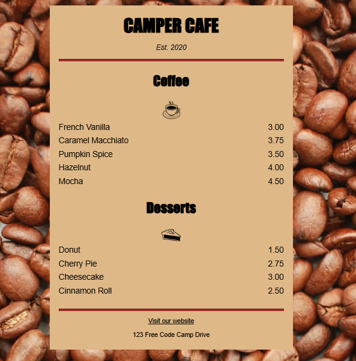     |
| Colored Markers       | Colorful marker layout using CSS Box Model               | 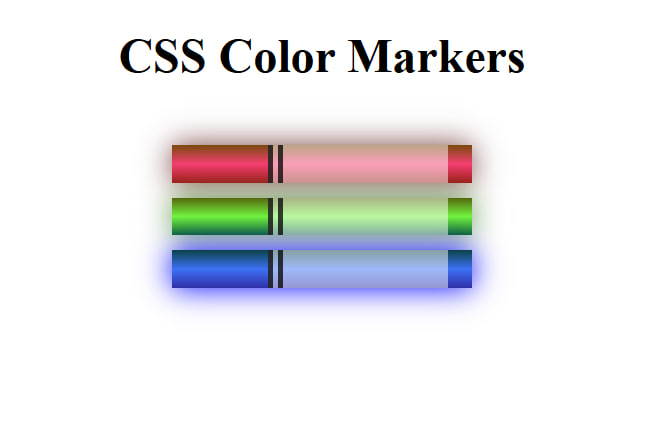 |
| Nutrition Label       | Nutrition facts label design using HTML & CSS            | 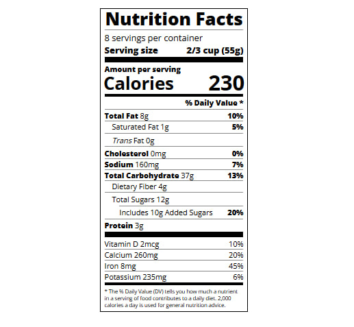 |
| Quiz                  | Interactive quiz layout designed with HTML & CSS         | 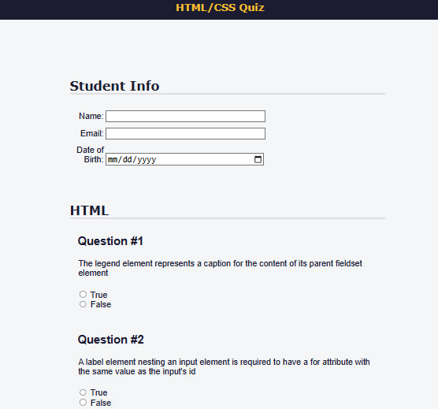                |
| Tribute Page          | Tribute page with semantic structure and responsive CSS  | 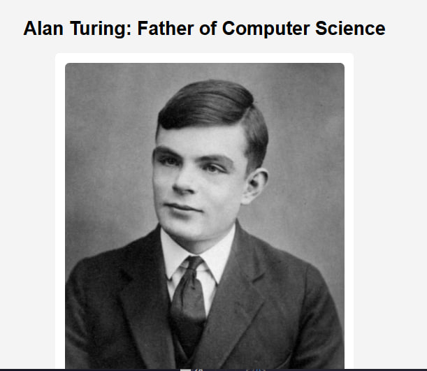|
| Balance Sheet         | Responsive balance sheet styled with modern CSS          | 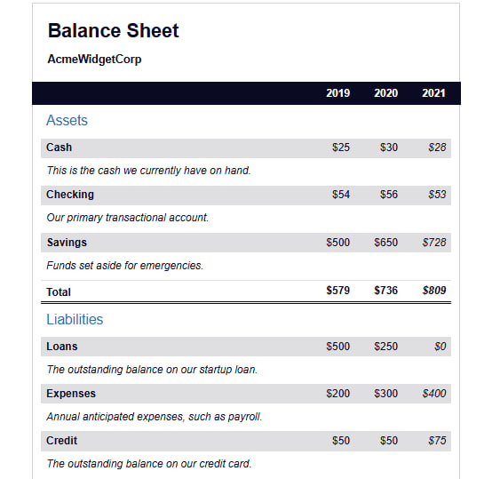 |
| Cat Painting          | Cat illustration using only CSS                           | 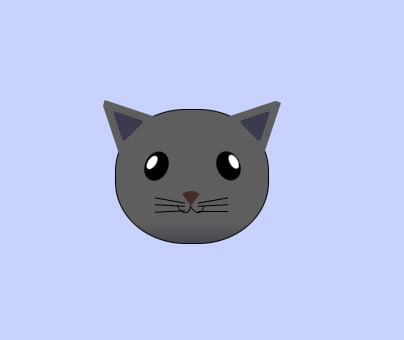|
| City Skyline          | Animated city skyline built with HTML & CSS               | 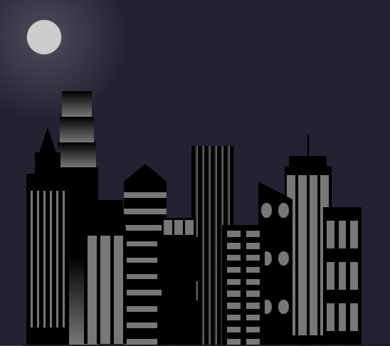|
| Ferris Wheel          | Ferris wheel animation using CSS                          | 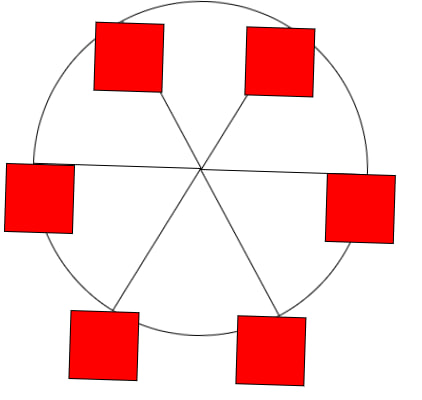|
| Magazine              | Clean magazine layout with HTML & CSS                     | 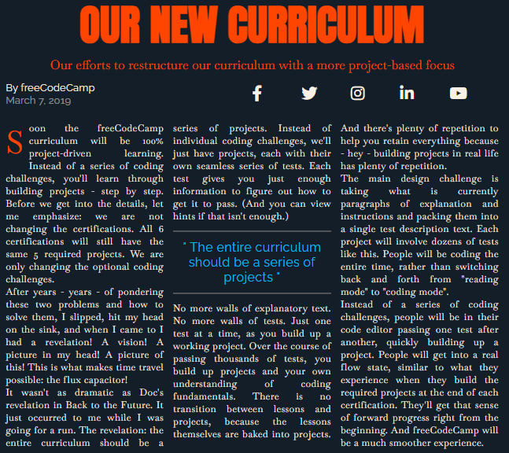         |
| Penguin               | Penguin illustration built entirely with CSS             | 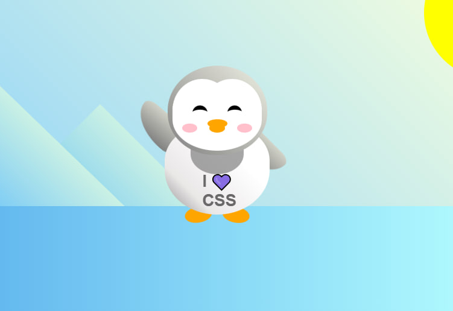           |
| Product Landing Page  | Responsive product landing page with attractive design   | 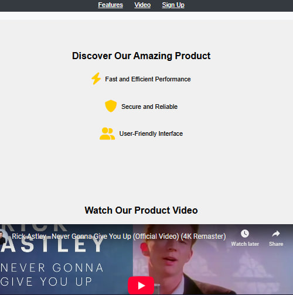 |
| Registration Form     | User registration form with HTML and CSS                 | 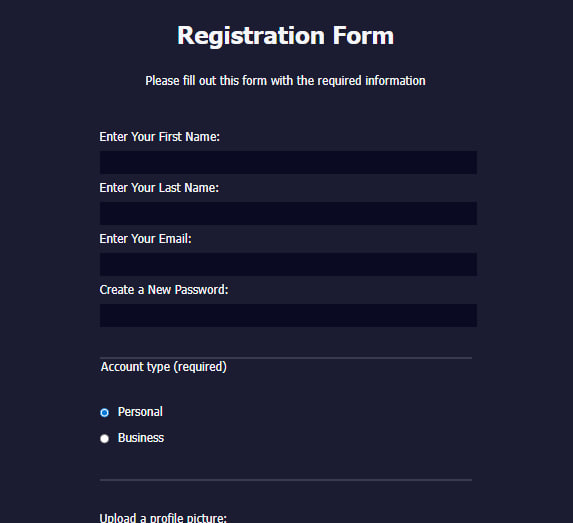 |

---

## About These Projects

These projects helped me improve skills in:
- Semantic HTML  
- CSS Flexbox & Grid layouts  
- Media Queries for responsive design  
- CSS animations and transitions  
- Writing clean, maintainable code  

---

## How to View

- Open the `index.html` file inside each project folder to preview locally.
- Live versions coming soon via GitHub Pages.

---

## Screenshots

Screenshots are stored in the `assets/screenshots/` folder.  
Replace the placeholder images with your actual screenshots.

---

## Connect with Me

Check out more projects on my [GitHub Profile](https://github.com/tala-maher).

---

## Contributions

Feel free to open issues or pull requests if you want to suggest improvements or fixes.

---

Thank you for visiting! 😊
